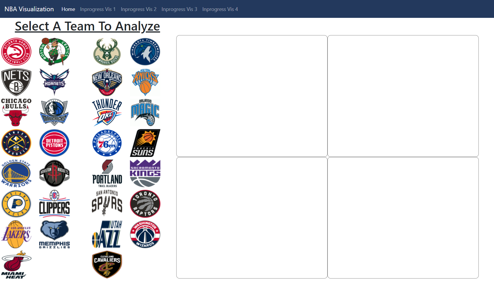

# NBA Visualization Final Project CSE 494:

### Completeted Features:

The features already implemented include the display of all 30 teams on a webpage that has all the corresponding team’s logos. There are 4 containers to the right of the logos that will display the data visualizations after 2 teams are selected. Currently the 4 containers have nothing, but will be adding the visualizations in the next implementation after the data sets have been finalized. Some other features to be completed include the hover action for the user to select a logo, and after the user has selected the logo, it will change the opacity or have a box around the logo to indicate which team is selected(not decided yet). In addition to that, there will be a double sided bar chart, radial pie chart, scatter plot, and a line chart. We also added the navigation to the web page, so if in the future we decide we need multiple pages then we can simply add links to them in the nav. This also gives our project a nice title so that the end user knows what web application they are using. In the navigation you may see work in progress vis X, this is solely for testing purposes, we may expand on these pages in the future.

### Changes since Proposal:

In the proposal, we originally had the 4 visualizations independent of each other and covering their own data subsets, now we will be using a common subset that our visualizations can animate upon. The dataset we proposed to use in the proposal was difficult to work around, so we found another dataset that would be more compatible with our visualizations after receiving feedback from the professor. The initial interaction for the team select was going to be a dropdown, but have changed it to a mouse select over team logos, which seems to be simpler and more attractive to the user. Overall the original idea was to have 4 different pages for each visualization, but now we will be having the visualizations displayed on the same page and interact with each other. The pie chart proposed in the proposal was also altered to be a little more complex, as now it shall be a radial bar chart. The geographic map projection in the proposal for visualization #1 has changed to a double sided bar chart(one above the x-axis and one below the x-axis, each for one team).

### Prototype:

### DataSet Source:

https://www.kaggle.com/ionaskel/nba-games-stats-from-2014-to-2018
